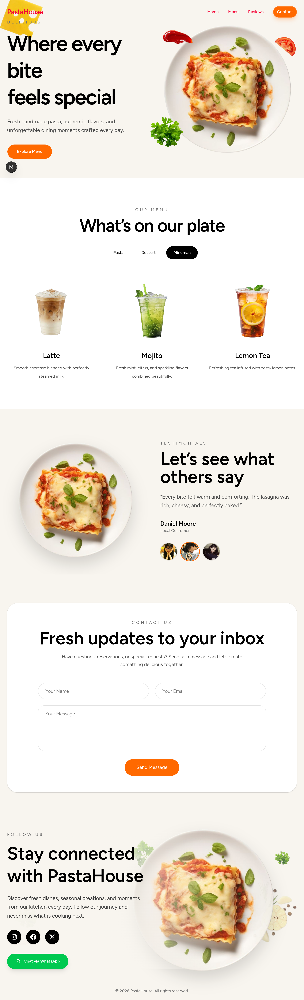

# UMKM Landing Page Template

Landing Page Template merupakan website berbasis Next.js yang dirancang sebagai media promosi digital untuk UMKM. Website ini berfungsi untuk menampilkan informasi usaha secara sederhana, mempermudah pengguna menemukan kanal media sosial, serta menyediakan area feedback sebagai bentuk interaksi awal dengan calon pelanggan.

Project ini dibuat sebagai template dan belum terintegrasi dengan sistem backend.

---

## Overview

Tujuan utama project ini adalah membuat tampilan landing page yang menarik, ringan, dan nyaman digunakan pada perangkat desktop maupun mobile.

Website difokuskan untuk:

- Menampilkan informasi UMKM secara sederhana
- Menjadi media promosi digital
- Mengarahkan pengguna ke media sosial
- Menyediakan simulasi alur feedback pelanggan

---

## Preview

---

## Tech Stack

Frontend:

- Next.js
- React
- TypeScript

Deployment:

- Vercel

---

## Features

- Responsive landing page
- Navigasi antar section menggunakan button
- Social media redirect button
- Form feedback (dummy)
- Optimasi tampilan untuk desktop dan mobile

---

## Project Structure

/app

/components

/lib

/public

---

## Installation

Clone repository:

git clone [repository-url]

Install dependencies:

npm install

Run development server:

npm run dev

Open:

http://localhost:3000

---

## What I Learned

Melalui project ini saya mempelajari:

- Membangun landing page menggunakan Next.js
- Mendesain pengalaman pengguna yang nyaman pada berbagai ukuran layar
- Mengelola struktur komponen frontend
- Menyusun navigasi sederhana untuk meningkatkan pengalaman pengguna
- Melakukan deployment menggunakan Vercel

---

## Future Improvements

- Integrasi backend untuk form feedback
- Dashboard admin untuk pengelolaan konten
- Penyimpanan data feedback
- Analitik interaksi pengguna

---

## Author

Ayu Qanita Putri
